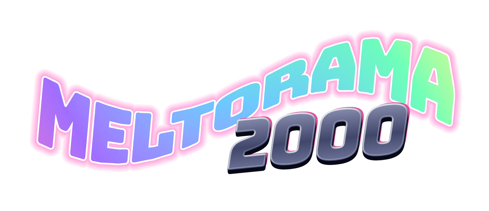
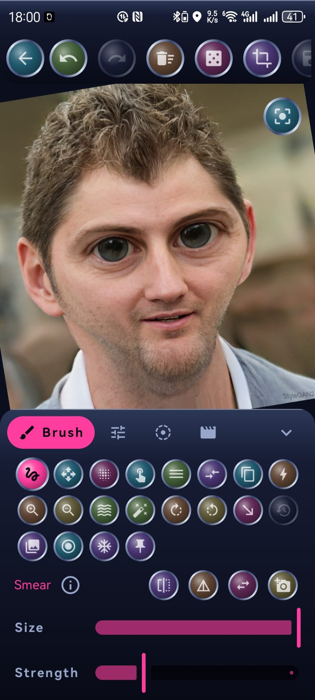
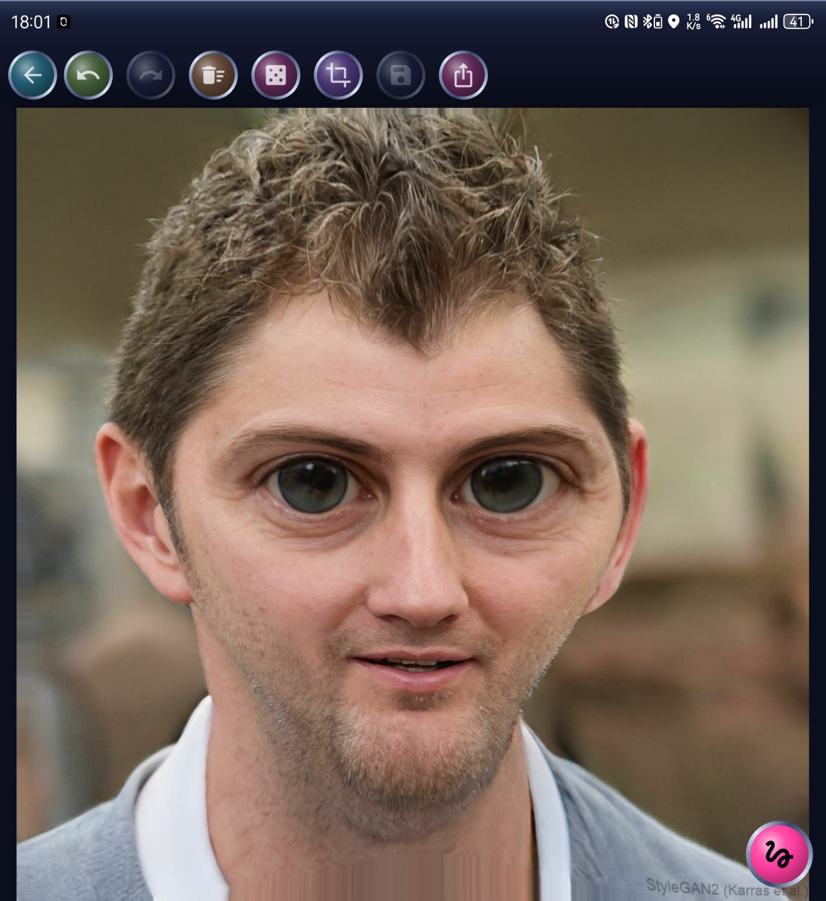

<div align="center">

<!-- The logo IS the h1: the landmark stays for screen readers and
     indexing (named by the alt text), without a duplicate visible
     title under the artwork. -->
<h1></h1>

**Goo Your Photos.**

[](https://github.com/L-K-M/Meltorama2000/actions/workflows/ci.yml)

Latest release: v<!-- version -->2.0.8<!-- /version --> · [Download](https://github.com/L-K-M/Meltorama2000/releases/latest)

</div>

<div align="center">
    
    &nbsp;
    
</div>

Meltorama 2000 is a fun photo-warping app for Android and macOS in the spirit
of Kai's Power Goo, the 1996 "Realtime Liquid Image Funware". Open a photo, drag a
finger or mouse through it like wet paint, balloon an eye, shrink a chin, twirl the
whole thing into a spiral — then save or share the result.

> [!IMPORTANT]
> **LLM disclosure:** this app is developed almost entirely by LLM agents,
> including its reviews. See [AGENTS.md](AGENTS.md) for the operational
> conventions and [PLAN.md](PLAN.md) for the design.

## Building

```sh
./gradlew assembleDebug        # or: scripts/build.sh --debug
scripts/install.sh             # build + install + launch on a device
```

Requirements: JDK 17, Android SDK (set `sdk.dir` in `local.properties` —
see `local.properties.example`). Both build types are signed with the
checked-in debug keystore so any clone produces installable,
upgrade-compatible APKs (a deliberate sideload-only decision — see
`docs/decisions/0002-zero-secret-signing.md`).

## Releasing

`scripts/release.sh X.Y.Z --push` — never hand-edit `versionCode`, never
create a `v*` tag by hand. CI publishes the APK to GitHub Releases.

## License

[Unlicense](LICENSE) — public domain. "Kai's Power Goo" and "KPT" are
referenced as historical inspiration only; this project is unaffiliated
with their past or present rights holders.

## Native macOS application

Build and launch with `scripts/build.sh --run`, or install straight into
/Applications with `scripts/build.sh --install` (the lower-level
`scripts/build-macos.sh` remains available for packaging flags like
`--universal`). The native editor includes the full brush
palette, effects, lenses, Fusion, and GOOvie exports, using compatible project
packages. See [macos/README.md](macos/README.md) for builds, interaction, and recovery.
